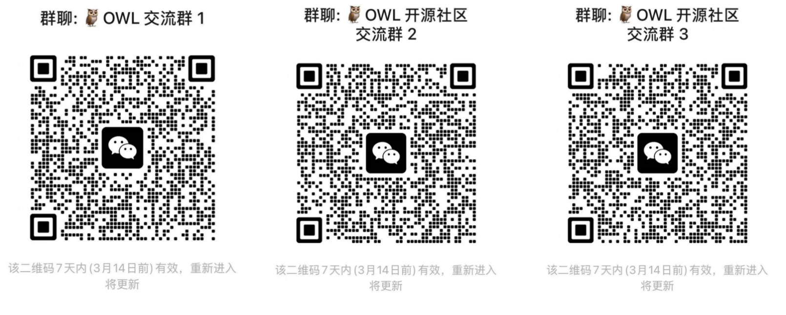
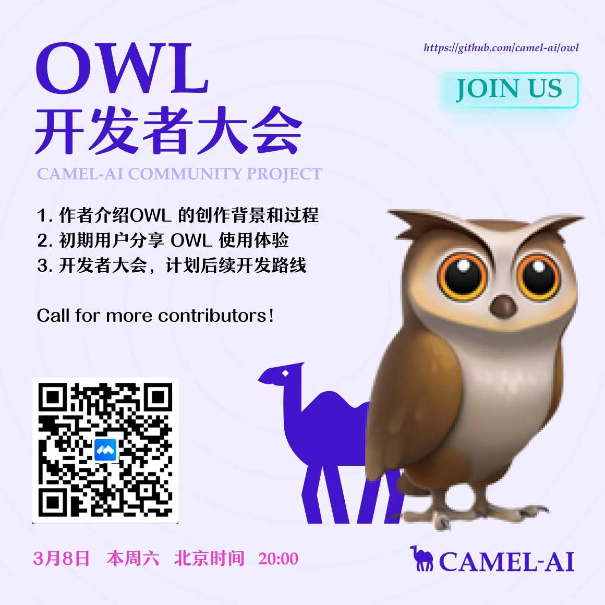

<h1 align="center">
	🦉 OWL: Optimized Workforce Learning for General Multi-Agent Assistance in Real-World Task Automation
  🦉 OWL: 优化劳动力学习的通用智能体，用于处理现实世界的自动化任务
</h1>


<div align="center">

[![文档][docs-image]][docs-url]
[![Discord][discord-image]][discord-url]
[![X][x-image]][x-url]
[![Reddit][reddit-image]][reddit-url]
[![微信][wechat-image]][wechat-url]
[![微信][owl-image]][owl-url]
[![Hugging Face][huggingface-image]][huggingface-url]
[![Star][star-image]][star-url]
[![软件许可证][package-license-image]][package-license-url]


</div>


<hr>

<div align="center">
<h4 align="center">

[English README](https://github.com/camel-ai/owl/tree/main) |
[社区](https://github.com/camel-ai/camel#community) |
[安装](#️-installation) |
[示例](https://github.com/camel-ai/owl/tree/main/owl) |
[论文](https://arxiv.org/abs/2303.17760) |
[引用](#-community) |
[贡献](https://github.com/camel-ai/owl/graphs/contributors) |
[CAMEL-AI](https://www.camel-ai.org/)

</h4>

<div align="center" style="background-color: #f0f7ff; padding: 10px; border-radius: 5px; margin: 15px 0;">
  <h3 style="color: #1e88e5; margin: 0;">
    🏆 OWL 在 GAIA 基准测试中取得 <span style="color: #d81b60; font-weight: bold; font-size: 1.2em;">58.18</span> 平均分，在开源框架中排名 <span style="color: #d81b60; font-weight: bold; font-size: 1.2em;">🏅️ #1</span>！ 🏆
  </h3>
</div>

<div align="center">

🦉 OWL 是一个前沿的多智能体协作框架，推动任务自动化的边界，构建在 [CAMEL-AI Framework](https://github.com/camel-ai/camel)。

我们的愿景是彻底变革 AI 智能体协作解决现实任务的方式。通过利用动态智能体交互，OWL 实现了跨多领域更自然、高效且稳健的任务自动化。

</div>


<br>


</div>

<!-- # Key Features -->
# 📋 目录

- [📋 目录](#-目录)
- [🔥 新闻](#-新闻)
- [🎬 演示视频](#-演示视频)
- [✨️ 核心功能](#-核心功能)
- [🛠️ 安装](#️-安装)
  - [**选项1：使用 uv（推荐）**](#选项1使用-uv推荐)
  - [**选项2：使用 venv 和 pip**](#选项2使用-venv-和-pip)
  - [**选项3：使用 conda**](#选项3使用-conda)
  - [**设置环境变量**](#设置环境变量)
  - [**使用Docker运行**](#使用docker运行)
- [🚀 快速开始](#-快速开始)
- [🌐 网页界面](#-网页界面)
- [🧪 实验](#-实验)
- [⏱️ 未来计划](#️-未来计划)
- [📄 许可证](#-许可证)
- [🖊️ 引用](#️-引用)
- [🔥 社区](#-社区)
- [❓ 常见问题](#-常见问题)


# 🔥 新闻

- **[2025.03.07]**: 我们开源了 🦉 OWL 项目的代码库。

# 🎬 演示视频

https://private-user-images.githubusercontent.com/55657767/420211368-f29f477d-7eef-46da-8d7a-8f3bcf506da2.mp4

https://private-user-images.githubusercontent.com/55657767/420212194-e813fc05-136a-485f-8df3-f10d9b4e63ec.mp4

# ✨️ 核心功能

- **在线搜索**：使用维基百科、谷歌搜索等，进行实时信息检索
- **多模态处理**：支持互联网或本地视频、图片、语音处理
- **浏览器操作**：借助Playwright框架开发浏览器模拟交互，支持页面滚动、点击、输入、下载、历史回退等功能
- **文件解析**：word、excel、PDF、PowerPoint信息提取，内容转文本/Markdown
- **代码执行**：编写python代码，并使用解释器运行
- **丰富工具包**：提供丰富的工具包，包括ArxivToolkit（学术论文检索）、AudioAnalysisToolkit（音频分析）、CodeExecutionToolkit（代码执行）、DalleToolkit（图像生成）、DataCommonsToolkit（数据共享）、ExcelToolkit（Excel处理）、GitHubToolkit（GitHub交互）、GoogleMapsToolkit（地图服务）、GoogleScholarToolkit（学术搜索）、ImageAnalysisToolkit（图像分析）、MathToolkit（数学计算）、NetworkXToolkit（图形分析）、NotionToolkit（Notion交互）、OpenAPIToolkit（API操作）、RedditToolkit（Reddit交互）、SearchToolkit（搜索服务）、SemanticScholarToolkit（语义学术搜索）、SymPyToolkit（符号计算）、VideoAnalysisToolkit（视频分析）、WeatherToolkit（天气查询）、WebToolkit（网页交互）等多种专业工具，满足各类特定任务需求。

# 🛠️ 安装

## 选项1：使用 uv（推荐）

```bash
# 克隆 GitHub 仓库
git clone https://github.com/camel-ai/owl.git

# 进入项目目录
cd owl

# 如果你还没有安装 uv，请先安装
pip install uv

# 创建虚拟环境并安装依赖
# 我们支持使用 Python 3.10、3.11、3.12
uv venv .venv --python=3.10

# 激活虚拟环境
# 对于 macOS/Linux
source .venv/bin/activate
# 对于 Windows
.venv\Scripts\activate

# 安装 CAMEL 及其所有依赖
uv pip install -e .

# 完成后退出虚拟环境
deactivate
```

## 选项2：使用 venv 和 pip

```bash
# 克隆 GitHub 仓库
git clone https://github.com/camel-ai/owl.git

# 进入项目目录
cd owl

# 创建虚拟环境
# 对于 Python 3.10（也适用于 3.11、3.12）
python3.10 -m venv .venv

# 激活虚拟环境
# 对于 macOS/Linux
source .venv/bin/activate
# 对于 Windows
.venv\Scripts\activate

# 从 requirements.txt 安装
pip install -r requirements.txt
```

## 选项3：使用 conda

```bash
# 克隆 GitHub 仓库
git clone https://github.com/camel-ai/owl.git

# 进入项目目录
cd owl

# 创建 conda 环境
conda create -n owl python=3.10

# 激活 conda 环境
conda activate owl

# 选项1：作为包安装（推荐）
pip install -e .

# 选项2：从 requirements.txt 安装
pip install -r requirements.txt

# 完成后退出 conda 环境
conda deactivate
```

## **设置环境变量**  

在 `owl/.env_template` 文件中，你可以找到所有必要的 API 密钥以及各服务的注册网址。要使用这些 API 服务，请按照以下步骤操作：

1. *复制并重命名*: 复制 `.env_template` 文件，并将副本重命名为 `.env`。
2. *填写你的密钥*: 打开 `.env` 文件，在相应字段中填入你的 API 密钥。 
3. *如需使用更多其他模型*：请参考我们CAMEL的models文档：https://docs.camel-ai.org/key_modules/models.html#supported-model-platforms-in-camel

> **注意**：为获得最佳性能，我们强烈建议使用 OpenAI 模型。我们通过测试发现，其他模型在处理复杂任务和基准测试时可能会导致性能显著降低。

## **使用Docker运行**

如果您希望使用Docker运行OWL项目，我们提供了完整的Docker支持：

```bash
# 克隆仓库
git clone https://github.com/camel-ai/owl.git
cd owl

# 配置环境变量
cp owl/.env_template owl/.env
# 编辑.env文件，填入您的API密钥

# 选项1：直接使用docker-compose
cd .container
docker-compose up -d
# 在容器中运行OWL
docker-compose exec owl bash -c "xvfb-python run.py"

# 选项2：使用提供的脚本构建和运行
cd .container
chmod +x build_docker.sh
./build_docker.sh
# 在容器中运行OWL
./run_in_docker.sh "您的问题"
```

更多详细的Docker使用说明，包括跨平台支持、优化配置和故障排除，请参阅 [DOCKER_README.md](.container/DOCKER_README.md)

# 🚀 快速开始
   
运行以下示例：

```bash
python owl/run.py
```

我们还提供了一个最小化示例，只需配置LLM的API密钥即可运行：

```bash
python owl/run_mini.py
```

## 使用不同的模型

OWL 支持多种 LLM 后端。您可以使用以下脚本来运行不同的模型：

```bash
# 使用 Qwen 模型运行
python owl/run_qwen.py

# 使用 Deepseek 模型运行
python owl/run_deepseek.py

# 使用其他 OpenAI 兼容模型运行
python owl/run_openai_compatiable_model.py
```

你可以通过修改 `run.py` 脚本来运行自己的任务：

```python
# Define your own task
question = "Task description here."

society = construct_society(question)
answer, chat_history, token_count = run_society(society)

print(f"\033[94mAnswer: {answer}\033[0m")
```

上传文件时，只需提供文件路径和问题：

```python
# 处理本地文件（例如，文件路径为 `tmp/example.docx`）
question = "给定的 DOCX 文件中有什么内容？文件路径如下：tmp/example.docx"

society = construct_society(question)
answer, chat_history, token_count = run_society(society)

print(f"答案：{answer}")
```

OWL 将自动调用与文档相关的工具来处理文件并提取答案。

你可以尝试以下示例任务：
- "查询苹果公司的最新股票价格"
- "分析关于气候变化的最新推文情绪"
- "帮我调试这段 Python 代码：[在此粘贴你的代码]"
- "总结这篇研究论文的主要观点：[论文URL]"

# 🌐 网页界面

OWL 现在包含一个基于网页的用户界面，使与系统交互变得更加容易。要启动网页界面，请运行：

```bash
python run_app.py
```

网页界面提供以下功能：

- **便捷的模型选择**：选择不同的模型（OpenAI、Qwen、DeepSeek等）
- **环境变量管理**：直接从界面配置API密钥和其他设置
- **交互式聊天界面**：通过用户友好的界面与OWL智能体交流
- **任务历史**：查看交互的历史记录和结果

网页界面使用Gradio构建，在您的本地机器上运行。除了您配置的模型API调用所需的数据外，不会向外部服务器发送任何数据。

# 🧪 实验

我们提供了一个脚本用于复现 GAIA 上的实验结果。
要复现我们在 GAIA 基准测试中获得的 58.18 分：

1. 切换到 `gaia58.18` 分支：
```bash
git checkout gaia58.18
```

2. 运行评估脚本：
```bash
python run_gaia_roleplaying.py
```

# ⏱️ 未来计划

- [ ] 撰写一篇技术博客，详细介绍我们在现实任务中多智能体协作方面的探索与见解。
- [ ] 通过引入更多针对特定领域任务的专业工具，进一步完善工具生态系统。
- [ ] 开发更复杂的智能体交互模式和通信协议


# 📄 许可证

源代码采用 Apache 2.0 许可证。

# 🖊️ 引用

如果你觉得这个仓库对你有帮助，请引用：


```
@misc{owl2025,
  title        = {OWL: Optimized Workforce Learning for General Multi-Agent Assistance in Real-World Task Automation},
  author       = {{CAMEL-AI.org}},
  howpublished = {\url{https://github.com/camel-ai/owl}},
  note         = {Accessed: 2025-03-07},
  year         = {2025}
}
```

# 🔥 社区
加入我们，参与更多讨论！
<!--  -->

<!--  -->

# ❓ 常见问题

**Q: 为什么启动示例脚本后，我没有看到本地运行Chrome浏览器？**

A: 当OWL判断某个任务可以使用非浏览器工具（如搜索、代码分析等）完成时，浏览器就不会启动。只有在判断需要使用浏览器工具的时候，本地才会弹出浏览器窗口，并进行浏览器模拟交互。

[docs-image]: https://img.shields.io/badge/Documentation-EB3ECC
[docs-url]: https://camel-ai.github.io/camel/index.html
[star-image]: https://img.shields.io/github/stars/camel-ai/owl?label=stars&logo=github&color=brightgreen
[star-url]: https://github.com/camel-ai/owl/stargazers
[package-license-image]: https://img.shields.io/badge/License-Apache_2.0-blue.svg
[package-license-url]: https://github.com/camel-ai/owl/blob/main/licenses/LICENSE

[colab-url]: https://colab.research.google.com/drive/1AzP33O8rnMW__7ocWJhVBXjKziJXPtim?usp=sharing
[colab-image]: https://colab.research.google.com/assets/colab-badge.svg
[huggingface-url]: https://huggingface.co/camel-ai
[huggingface-image]: https://img.shields.io/badge/%F0%9F%A4%97%20Hugging%20Face-CAMEL--AI-ffc107?color=ffc107&logoColor=white
[discord-url]: https://discord.camel-ai.org/
[discord-image]: https://img.shields.io/discord/1082486657678311454?logo=discord&labelColor=%20%235462eb&logoColor=%20%23f5f5f5&color=%20%235462eb
[wechat-url]: https://ghli.org/camel/wechat.png
[wechat-image]: https://img.shields.io/badge/WeChat-CamelAIOrg-brightgreen?logo=wechat&logoColor=white
[x-url]: https://x.com/CamelAIOrg
[x-image]: https://img.shields.io/twitter/follow/CamelAIOrg?style=social
[twitter-image]: https://img.shields.io/twitter/follow/CamelAIOrg?style=social&color=brightgreen&logo=twitter
[reddit-url]: https://www.reddit.com/r/CamelAI/
[reddit-image]: https://img.shields.io/reddit/subreddit-subscribers/CamelAI?style=plastic&logo=reddit&label=r%2FCAMEL&labelColor=white
[ambassador-url]: https://www.camel-ai.org/community
[owl-url]: ./assets/qr_code.jpg
[owl-image]: https://img.shields.io/badge/WeChat-OWLProject-brightgreen?logo=wechat&logoColor=white
